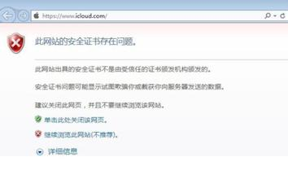

# https协议相关资料整理

## 什么是https

HTTPS安全超文本传输协议，它是一个安全通信通道，它基于HTTP开发，用于在客户计算机和服务器之间交换信息。它使用安全套接字层(SSL)进行信息交换，简单来说它是HTTP的安全版。简单来说，https是http的升级版，具备更安全的传输协议，在一些对安全性要求很高的网站，通常会采用这种协议。比如大家在电脑中登陆支付宝，也会看到网址前面是以https开头，而不是普通网站的http前缀

[https相关资料汇总](http://www.admin5.com/special/https/)

## https 协议与http协议的区别

- https更安全

HTTPS协议是由SSL+HTTP协议构建的可进行加密传输、身份认证的网络协议，要比http协议安全。

- https需要申请证书

https协议需要到ca申请证书，一般免费证书很少，需要交费，而常见的http协议则没有这一项。

- 端口不同

http使用的是大家最常见的80端口，而https连接使用的是443端口。

- 状态不同

http的连接很简单,是无状态的。而HTTPS协议是由SSL+HTTP协议构建的可进行加密传输、身份认证的网络协议，要比http协议安全。

## https证书相关

https协议需要到ca申请证书（SSL证书），SSL证书是数字证书的一种，类似于驾驶证、护照和营业执照的电子副本。SSL证书通过在客户端浏览器和Web服务器之间建立一条SSL安全通道(Secure socket layer(SSL)安全协议是由Netscape Communication公司设计开发。该安全协议主要用来提供对用户和服务器的认证;对传送的数据进行加密和隐藏;确保数据在传送中不被改变，即数据的完整性，现已成为该领域中全球化的标准。由于SSL技术已建立到所有主要的浏览器和WEB服务器程序中，因此，仅需安装服务器证书就可以激活该功能了)。即通过它可以激活SSL协议，实现数据信息在客户端和服务器之间的加密传输，可以防止数据信息的泄露。保证了双方传递信息的安全性，而且用户可以通过服务器证书验证他所访问的网站是否是真实可靠。

如果没有向CA申请证书，我们搭建的测试https环境，或者我们内部使用的web服务，只是想用https的加密链路的功能，则可以在web服务器上（tomcat,nginx等）创建一种自签名证书，这种证书是不被浏览器信任的，会出现警告，但是不影响使用。

IE中自签名证书不被信任提示，这里点 `继续浏览此网站`

#### 相关资料

[tomcat https配置及创建签名证书](http://blog.sina.com.cn/s/blog_64a52f2a0101g35m.html)

[给Nginx配置一个自签名的SSL证书](http://www.liaoxuefeng.com/article/0014189023237367e8d42829de24b6eaf893ca47df4fb5e000)

## 免费证书申请

申请SSL证书之前，你的网站必须要有域名，IP地址的方式是不能申请证书的。所以在申请证书前，需要先申请域名并绑定到服务器上。

大部份的https证书是要收费的，但是如果肯花时间，也有免费的方案选择。现提供两个免费方式参考。

- startSSL

[StartSSL](https://www.startssl.com) 是全球第6大CA证书颁发机构，提供入门级的免费证书，有效期一年，证书失效的前两周会发邮件给你，可以进行免费续期处理。

[StartSSL证书申请流程](http://www.admin5.com/article/20101111/288229.shtml)

[StartSSL证书申请和配置](http://www.oschina.net/translate/switch-to-https-now-for-free?cmp)

[给Nginx配置一个自签名的SSL证书，nginx https 及证书配置](http://www.liaoxuefeng.com/article/0014189023237367e8d42829de24b6eaf893ca47df4fb5e000)

- Let's Encryt

[Let's Encryt](https://letsencrypt.org)是国外一个公共的免费SSL项目，由 Linux 基金会托管，它的来头不小，由Mozilla、思科、Akamai、IdenTrust和EFF等组织发起，目的就是向网站自动签发和管理免费证书，以便加速互联网由HTTP过渡到HTTPS，目前Facebook等大公司开始加入赞助行列。

Let's Encrypt 通过使用[ ACME](https://github.com/letsencrypt/acme-spec)协议来自动管理证书，官方提供了基于该协议的证书管理工具[certbot](https://certbot.eff.org),可以自动向CA申请证书，向nginx或apache服务器安装证书。certbot目前支持类Unix系统，不支持windows。对windows，可以使用[ACMESharp](https://github.com/ebekker/ACMESharp)等第三方客户端实现。

[Let's Encrypt 工作原理](https://letsencrypt.org/how-it-works/)

[Let's Encrypt 安装使用教程](http://www.chinaz.com/web/2015/1221/486106.shtml?qq-pf-to=pcqq.group&_t_t_t=0.2286500814370811)

## 通过反向代理的方式使用https

后端应用服务器（tomcat,jetty)，布署的业务系统（oa系统及其它管理端）可以使用原有的http协议。而是在它们的前端web服务器(nginx,apache,IIS)配反向代理的方式，在前端web服务器上配置好https服务，通过https提供给公网访问,后端的业务系统不直接暴露到公网上。

nginx 的配置为 `https://www.server.propersoft.cn:4444/nexus/`  来访问后端的nexus服务。后端的业务系统地址为`http://localhost:5556/nexus/` 

	location /nexus/ {
		proxy_pass http://localhost:5556/nexus/;
		 # Forward the user's IP address to Rails
		proxy_set_header   X-Real-IP            $remote_addr;
		proxy_set_header   X-Forwarded-For  $proxy_add_x_forwarded_for;
		proxy_set_header   X-Forwarded-Proto $scheme;
		proxy_set_header   Host                   $host:4444;
		proxy_set_header   REMOTE-HOST            $remote_addr;
		proxy_set_header   X-NginX-Proxy    true;
		proxy_set_header   Connection "";
		proxy_http_version 1.1;       
	}	

## http自动跳转到https

如果我们通过[http://www.baidu.com](http://www.baidu.com)  这种http的方式打开百度网站，默认会跳转到`https://www.baidu.com`,以强制用户使用https协议，以提高安全性。

[nginx中http跳转到https设置方法](http://www.cnblogs.com/yun007/p/3739182.html)