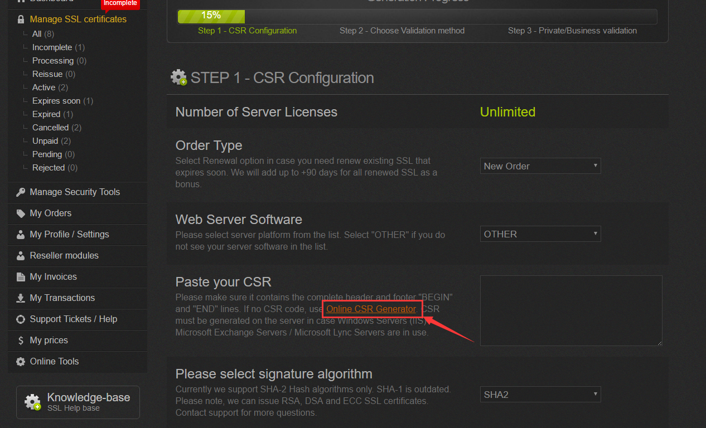

# 阿里云CA证书申请流程

#### 以下为申请的详细步骤：

**1、查看购买流程：**


**2、登录上述地址后点击购买证书，然后进入下一页挑选不同类型的证书：**


**3、填写个人信息：**


**4、填写完个人信息提交后、需要在服务器创建阿里云要求目录 .well-known/pki-vilidation，下载专有验证文件fileauth.txt到本地计算机目录中，不要编辑，不要打开，不要重新命名。都配置好后点击检查配置：**


**5、等待审核通过签发后点击下载：**


**6、下载到服务器上配置nginx，完成证书申请：**


```
server {
        listen 443 ssl;
        server_name services.propersoft.cn;
        charset utf-8;

        ssl_session_cache shared:SSL:10m;
        ssl_session_timeout 10m;
        ssl_protocols TLSv1.2;
        ssl_prefer_server_ciphers on;
        ssl_ciphers ALL:!aNULL:!EXPORT56:RC4+RSA:+HIGH:+MEDIUM:+LOW:+SSLv2:+EXP;
        ssl_stapling on;
        ssl_stapling_verify on;

        ssl_certificate /etc/nginx/services.propersoft.cn.pem;
        ssl_certificate_key /etc/nginx/services.propersoft.cn.key;

        add_header Strict-Transport-Security "max-age=31536000; includeSubdomains" always;

        location / {
            default_type application/octet-stream;
            root /etc/nginx/services/;
        }

    }
```


# Comodo Trial SSL证书申请流程

#### 以下为申请的详细步骤：

**1、访问https://my.gogetssl.com/en/ 登录账号。**

**2、点击New Order**


**3、举例：点击购买免费试用三个月的Comodo Trial SSL**


**4、点击Complete Order**


**5、点击Incomplete Orders**


**6、点击Generate**


**7、点击Online CSR Generator**



**8、填写完成后点击Generate CSR**


**9、粘贴完CSR后点击Validate CSR**


**10、选择好验证方式后下载Download file文件点击Next Step**


**11、填写完成后点击Complete Generation**


**12、点击Manage SSL，完成**


**13、将Private Server Key拷贝至services_propersoft.cn.key，执行命令openssl rsa -in services_propersoft.cn.key -out services_propersoft.cn.key生成key文件**

**14、nginx配置**

```
server {
        listen 443 ssl;
        server_name services.propersoft.cn;
        charset utf-8;

        ssl_session_cache shared:SSL:10m;
        ssl_session_timeout 10m;
        ssl_protocols TLSv1.2;
        ssl_prefer_server_ciphers on;
        ssl_ciphers ALL:!aNULL:!EXPORT56:RC4+RSA:+HIGH:+MEDIUM:+LOW:+SSLv2:+EXP;
        ssl_stapling on;
        ssl_stapling_verify on;

        ssl_certificate /etc/nginx/services_propersoft.cn.crt;
        ssl_certificate_key /etc/nginx/services_propersoft.cn.key;

        add_header Strict-Transport-Security "max-age=31536000; includeSubdomains" always;

        location / {
            default_type application/octet-stream;
            root /etc/nginx/services/;
        }

    }
```


