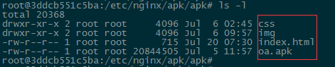

# 掌上办公安卓应用详细分发及部署流程

### 内网环境服务器搭建webserver应用服务，以nginx web服务为例：

- 服务器系统：Ubuntu 16.04 LTS、服务器IP地址：192.168.1.196，配置内网nginx可访问url，举例服务器路径为：/etc/nginx/apk/apk/，nginx配置如下：

```
    server {
        listen 80;
        server_name localhost;
        charset utf-8;
        location /apk/ {
            default_type application/octet-stream;
            root /etc/nginx/apk/;
        }
    }
 ```
 
- 将静态资源文件及apk包等相关文件上传到192.168.1.196服务器 /etc/nginx/apk/apk/目录下。

**

- 在安卓移动端浏览器请求 http://192.168.1.196/apk/ 点击下载或者扫描下载。

**


