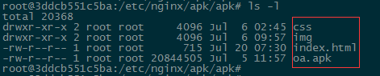

# 掌上办公安卓应用部署流程

## 环境准备

操作系统 | Web服务|Docker版本
-----------|-----------|-----------
Ubuntu 16.04 LTS|Nginx 1.6 以上|1.11 以上

## 部署步骤

#### 1. 安装 Ubuntu 16.04 LTS Server
#### 2. 安装 Docker
#### 3. 部署 Docker Nginx容器
#### 4. 上传安卓应用程序相关


## 安装 Ubuntu 16.04 LTS Server

- **Ubuntu Server 介绍参考:**https://help.ubuntu.com/lts/serverguide/index.html

- ** Ubuntu Server 安装参考:**http://www.360doc.com/content/17/0222/11/17572791_631069401.shtml

- **Linux 常用命令参考:**https://www.runoob.com/linux/linux-command-manual.html

## 安装 Docker

- **什么是Docker? 了解Docker参考:**http://www.docker.org.cn/book/docker/what-is-docker-16.html

Docker 安装分为两种安装方式，既**在线安装**和**离线安装**两种，如果服务器可以访问外网情况下，建议采用在线安装方式，如果不能访问外网，则必须用离线安装方式。

### Docker在线安装


- #### 安装aufs驱动linux-image-extra
```
sudo apt-get update
sudo apt-get install -y \
linux-image-extra-$(uname -r) \
linux-image-extra-virtual
```
#### 支持https 增加CA证书

sudo apt-get install -y --no-install-recommends \
apt-transport-https \
ca-certificates \
curl \
software-properties-common

#### 添加GPG Key(一种加密手段)

curl -fsSL https://apt.dockerproject.org/gpg | sudo apt-key add -

apt-key fingerprint 58118E89F3A912897C070ADBF76221572C52609D

#### 添加Ubuntu16.04 LST的入口

sudo add-apt-repository \
"deb https://apt.dockerproject.org/repo/ \
ubuntu-$(lsb_release -cs) \
main"

#### 
sudo apt-get update
sudo apt-get -y install docker-engine
apt-cache madison docker-engine
sudo apt-get -y install docker-engine=<VERSION_STRING>
sudo apt-get -y install docker-engine=1.13.1-0~ubuntu-xenial

#### 安装 docker-compose
```
curl -L https://github.com/docker/compose/releases/download/1.8.0/docker-compose-`uname -s`-`uname -m` > /usr/local/bin/docker-compose
chmod +x /usr/local/bin/docker-compose
```


### Docker离线安装
- 离线方式下载安装地址：https://get.docker.com/builds/Linux/x86_64/docker-latest.tgz
```
# 复制下载的安装包到服务器内
# 解压缩安装包
$ tar -xvzf docker-latest.tgz
# 配置环境变量
$ vi /etc/profile
# 文件最后添加下列代码，保存并退出文件
$ export PATH="解压后的路径:$PATH"
# 在相同版本的linux上下载docker-compose，然后将下载后的文件放置到设置的环境变量路径下
# docker-compose下载命令
$ curl -L https://github.com/docker/compose/releases/download/1.8.0/docker-compose-`uname -s`-`uname -m` > /usr/local/bin/docker-compose
# 重新加载配置文件
$ source /etc/profile
```
- 修改Linux进程最大打开文件数
```
# 打开文件
$ vi /etc/profile
# 文件最后添加下列代码，保存并退出文件
$ ulimit -n 65539
# 重新加载配置文件
$ source /etc/profile
```
- 调整swap
```
# 打开文件
$ vi /etc/default/grub
# 修改文件内[GRUB_CMDLINE_LINUX=""]->[GRUB_CMDLINE_LINUX="cgroup_enable=memory swapaccount=1"]，保存并退出
# 更新 GRUB
$ update-grub
# 重启系统
```
- 启动docker
```
$ dockerd &
```

- 开机自动启动dockerd
```
# 创建/etc/init.d/dockerd启动脚本

$ cat <<eof>> /etc/init.d/dockerd
#!/bin/bash
# /etc/init.d/dockerd


### BEGIN INIT INFO
# Provides:           dockerd
# Required-Start:     $syslog $remote_fs
# Required-Stop:      $syslog $remote_fs
# Should-Start:       cgroupfs-mount cgroup-lite
# Should-Stop:        cgroupfs-mount cgroup-lite
# Default-Start:      2 3 4 5
# Default-Stop:       0 1 6
# Short-Description:  Create lightweight, portable, self-sufficient containers.
# Description:
#  Docker is an open-source project to easily create lightweight, portable,
#  self-sufficient containers from any application. The same container that a
#  developer builds and tests on a laptop can run at scale, in production, on
#  VMs, bare metal, OpenStack clusters, public clouds and more.
### END INIT INFO

export PATH=/sbin:/bin:/usr/sbin:/usr/bin:/usr/local/sbin:/usr/local/bin:/opt/docker/docker


case "$1" in
    start)
        echo "Starting dockerd"
        /opt/docker/docker/dockerd &
        ;;
    stop)
        echo "Stopping dockerd"
        #killall dockerd
        kill $(ps -ef | grep 'dockerd' | grep -v 'grep' | awk '{ print $2 }')
        ;;
    *)
        echo "Usage: service dockerd start|stop"
        exit 1
        ;;
esac
exit 0

eof

# 加到开机自动启动
$ systemctl unmask dockerd.socket
$ update-rc.d dockerd defaults

```


- 导出镜像
```
docker save hello-world > /home/user/hello-world_image.tar
```
- 导入镜像
```
docker load < /home/user/hello-world_image.tar
```


### 内网环境服务器搭建web应用服务，nginx web服务为例：

- 服务器系统：Ubuntu 16.04 LTS、服务器IP地址：192.168.1.196，配置内网nginx可访问url，举例服务器路径为：/etc/nginx/apk/apk/，nginx配置如下：

```
    server {
        listen 80;
        server_name localhost;
        charset utf-8;
        location /apk/ {
            default_type application/octet-stream;
            root /etc/nginx/apk/;
        }
    }
 ```
 
- 将静态资源文件及apk包等相关文件上传到192.168.1.196服务器 /etc/nginx/apk/apk/目录下。

**

- 在安卓移动端浏览器请求 http://192.168.1.196/apk/ 点击下载或者扫描下载。

**


