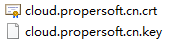

# 掌上办公移动应用发布流程

## 概述

掌上办公移动端APP目前分为安卓和IOS，安卓应用程序只需在内网搭建webserver服务，将其应用程序上传至内网服务器后，直接下载安装即可。IOS应用程序则要求域名解析和支持https协议才可以下载应用程序安装。

## 安卓应用发布简要准备内容

*1. 内网环境服务器搭建Webserver应用服务（操作系统建议：Ubuntu 16.04 LTS、Webserver建议用nginx服务）。*

*2. 将应用程序文件放到webserver对应目录下，在浏览器上通过请求相对路径可以访问到相关页面。*

*3. 在安卓移动端请求相关url地址或者通过扫码方式进行安装即可。*

## IOS应用发布简要准备内容

*1. 申请IOS企业开发者账号（申请地址:[https://developer.apple.com/account/](https://developer.apple.com/account/ "https://developer.apple.com/account/")）和选择邓白氏编码选项。*

*2. 准备一个可以dns解析的域名，例如 cloud.propersoft.cn域名。在命令行执行`ping cloud.propersoft.cn`命令可以ping通。*

*3. 申请该域名的https(CA)证书，申请机构如：赛门铁克、AWS等，申请下来的文件例如：**将申请的https证书文件配置到webserver服务器上。*

*4. 将ipa等相关配置文件放到webserver对应目录下，在浏览器上通过请求相对路径可以访问到相关页面。*

*5. 在打包应用里面配置相关路径及图片等。*

*6. 在IOS移动端请求相关url地址或者通过扫码方式进行安装即可。*

